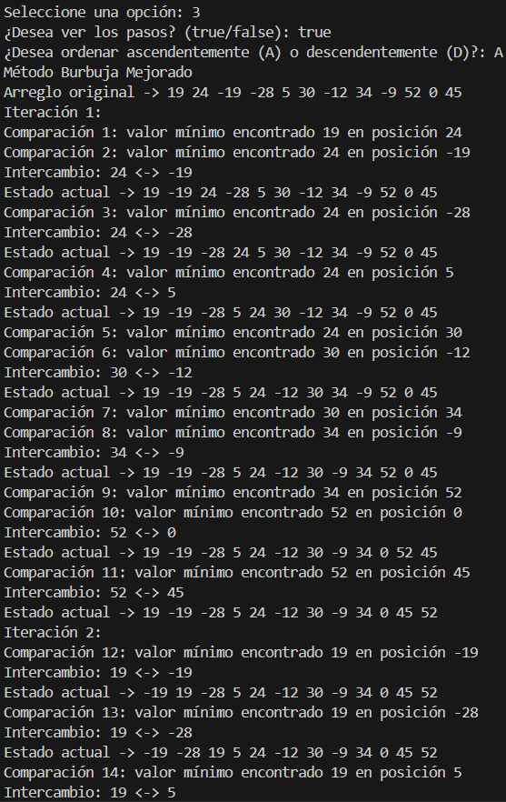
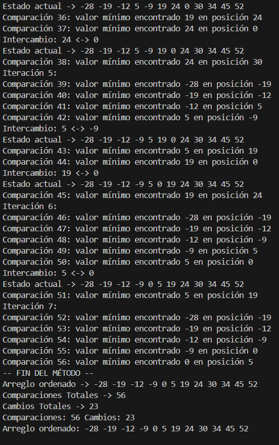
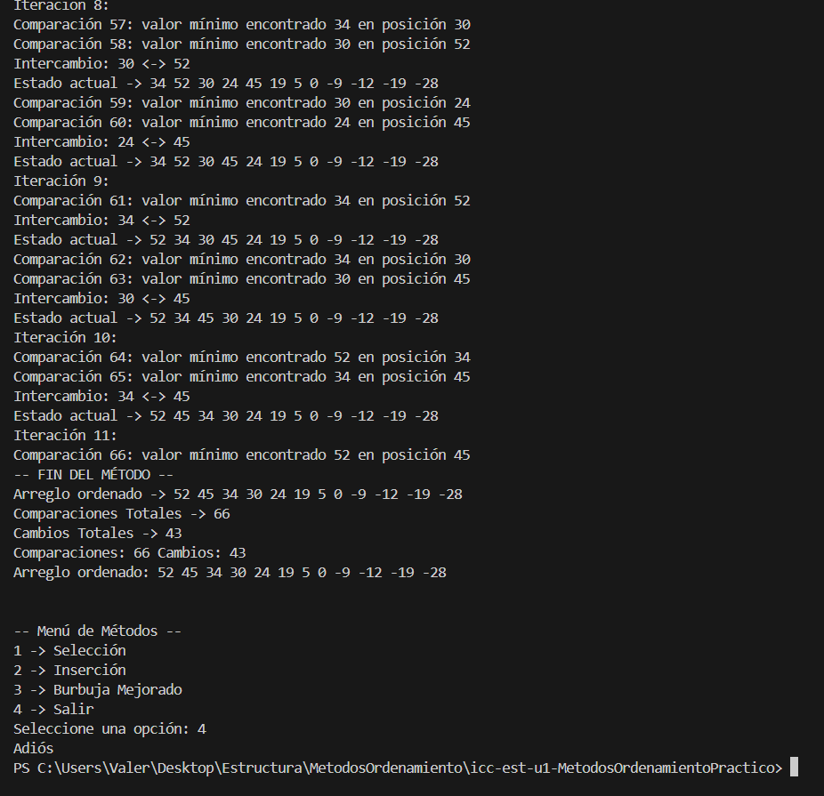
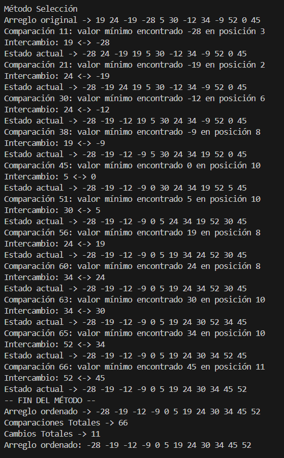
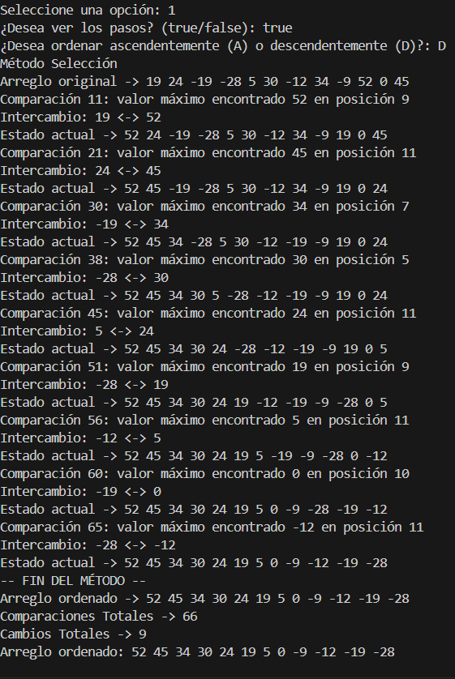
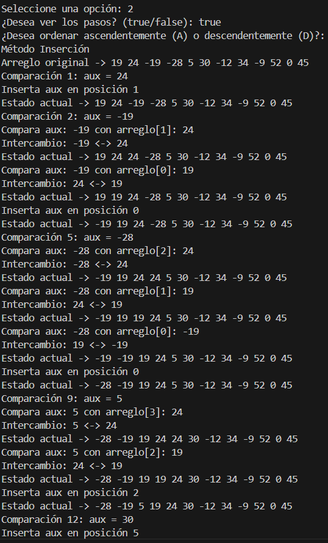
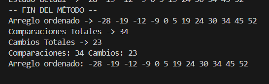
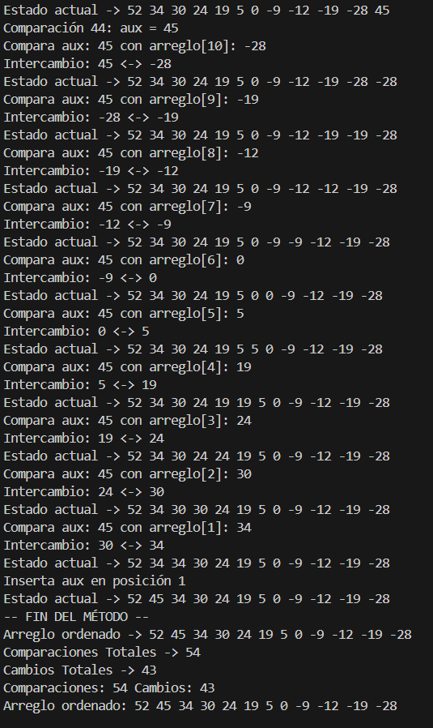

# Práctica de Algoritmos de Ordenamiento

## 📌 Información General

- **Título:** Práctica de Algoritmos de Ordenamiento
- **Asignatura:** Estructura de Datos
- **Carrera:** Computación
- **Estudiante:** [Kelly Valeria Guaman Leon]
- **Fecha:** [27/10/2025]
- **Profesor:** Ing. Pablo Torres

---

## 🛠️ Descripción

Este proyecto implementa y compara diferentes algoritmos de ordenamiento en Java, incluyendo:
- Método Burbuja
- Método Selección
- Método Inserción
- Método Burbuja Mejorado

Se permite elegir:
- Tipo de orden (Ascendente o Descendente).
- Visualización de pasos intermedios.
- Visualización del número de comparaciones y cambios.

---

## Metodo Burbuja Mejorada
Compara pares de elementos adyacentes y los intercambia si están en el orden incorrecto. Repite hasta que no haya más intercambios.

Cómo funciona:

-Recorre el arreglo varias veces.
-En cada pasada, compara arreglo[j] con arreglo[j+1].
-Si están mal ordenados, los intercambia.
-Si en una pasada no se hace ningún intercambio, termina antes (mejora).
-Repite hasta que todo esté ordenado.

## Burbuja mejorado Ascendente

## Burbuja mejorado Descendente

## Metodo Seleccion
Busca el valor mínimo o máximo en la parte no ordenada del arreglo y lo coloca en su posición correcta.

Cómo funciona:

-Recorre el arreglo desde el inicio.
-En cada posición i, busca el valor mínimo en el resto del arreglo (i+1 hasta el final).
-Cuando lo encuentra, lo intercambia con el valor en la posición i.
-Repite esto hasta que todo el arreglo esté ordenado

## Seleccion Ascendente

## Seleccion Descendente

## Metodo Insercion
Toma cada elemento y lo inserta en la posición correcta dentro de la parte ya ordenada del arreglo.

Cómo funciona:

-Empieza desde el segundo elemento (i = 1).
-Compara ese elemento (aux) con los anteriores.
-Si es menor o mayor, si es descendente, los va desplazando hacia la derecha.
-Cuando encuentra su lugar, lo inserta ahí.
-Repite esto hasta el final del arreglo.
### Insercion Ascendente

### Insercion Descendente

## Conclusion
La implementacion de los métodos de ordenamiento por selección, inserción y burbuja mejorada posibilitó que se entendiera con profundidad la manera en que se reorganizan los datos dentro de un arreglo a través de intercambios y comparaciones. Cada algoritmo tiene sus ventajas y sus desventajas dependiendo del tipo de datos y el grado de orden inicial.